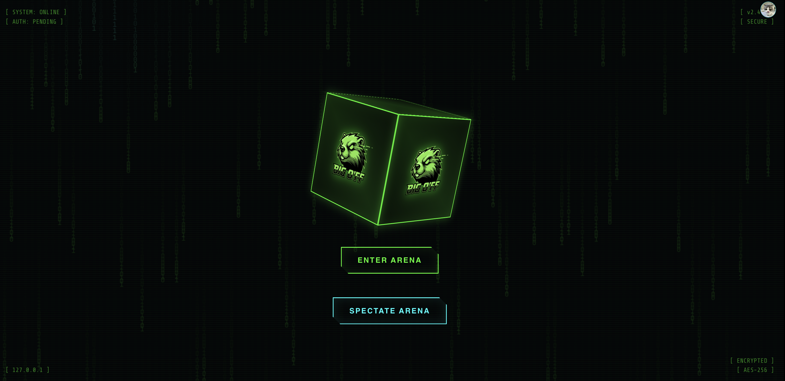
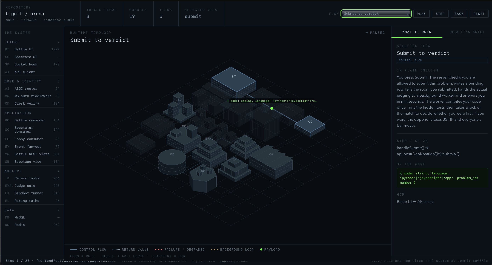
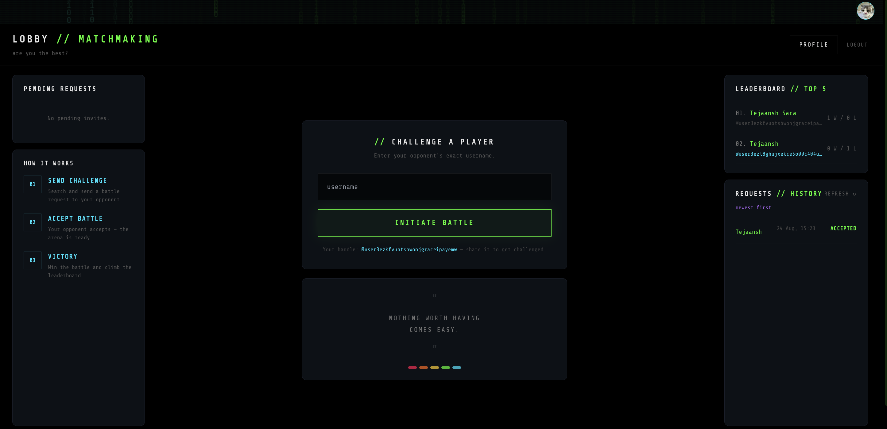
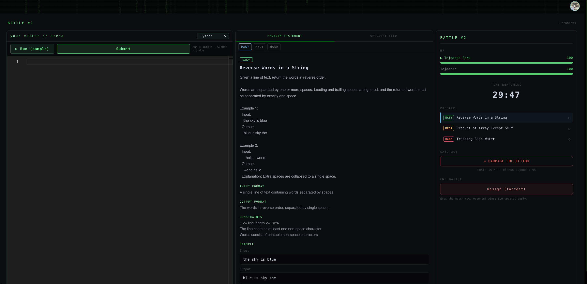

# Arena

**[big-off.vercel.app](https://big-off.vercel.app)**





Real-time coding battle platform with:
- **Frontend:** Next.js (`frontend`)
- **Backend API + WebSockets:** Django + Channels (`backend`)
- **Async workers:** Celery
- **Broker / channel layer:** Redis



[Interactive system map](https://big-o-ff.github.io/arena/runtime-map.html) · [Architecture, data model, concurrency and scaling](architecture.md)



---

## Project Structure

- `frontend` - Next.js app (battle UI, spectate UI, auth flows)
- `backend` - Django REST API, Channels consumers, Celery tasks
- `problems` - Problem dataset and related assets
- `architecture.md` - how the system works and why it was built this way

---

## Prerequisites

- Python 3.12+
- Node.js 18+ and npm
- Redis running on `127.0.0.1:6379` (channel layer, Celery broker, throttle cache)
- MySQL (or matching DB settings in `backend/config/settings.py`)
- A Clerk application (publishable key for the frontend, issuer URL for the backend)
- `g++` and `node` on PATH if you want C++ / JavaScript submissions to run

---

## One-Time Setup

### 1) Backend

```bash
cd backend
python3 -m venv .venv
source .venv/bin/activate
pip install -r requirements.txt
cp .env.example .env       # then fill in the required values
python3 manage.py migrate
```

Two variables in `backend/.env` have no defaults and the app will not start
without them:

- `DJANGO_SECRET_KEY` — generate with
  `python -c "from django.core.management.utils import get_random_secret_key as k; print(k())"`
- `CLERK_ISSUER` — your Clerk Frontend API origin, e.g.
  `https://your-app.clerk.accounts.dev`. Session tokens are verified against
  this issuer's JWKS; the server will not accept a token it cannot verify.

`migrate` seeds 12 judgeable problems (four per difficulty), which is all you
need to play. To load additional problems from a JSON file:

```bash
python3 manage.py import_problems path/to/problems.json
```

The bundled `problems/merged_problems.json` is a LeetCode scrape with no
stdin/stdout test cases, so the runner cannot score it. Importing it stores the
text but leaves every record inactive — it will not extend the battle rotation.
See the docstring in `problems/management/commands/import_problems.py` for the
format a playable problem needs.

### 2) Frontend

```bash
cd frontend
npm install
cp .env.local.example .env.local   # then fill in your Clerk keys
```

---

## Run Locally (4 Terminals)

### Terminal A - Backend API + WebSockets

```bash
cd backend
source .venv/bin/activate
daphne -b 127.0.0.1 -p 8000 config.asgi:application
```

### Terminal B - Celery Worker

```bash
cd backend
source .venv/bin/activate
celery -A config worker -l info -Q execution,events
```

### Terminal C - Redis

```bash
redis-server
```

### Terminal D - Frontend

```bash
cd frontend
npm run dev -- --hostname 0.0.0.0 --port 3000
```

Open: `http://localhost:3000`

---

## Quick Health Checks

- Backend API:
  ```bash
  curl -I http://127.0.0.1:8000/api/problems/
  ```
- Frontend:
  - Visit `http://localhost:3000`
- Redis:
  ```bash
  redis-cli ping
  ```
  Expect `PONG`.

---

## Common Issues

- **`Address already in use` (8000/3000/6379):**
  Another process is already running on that port. Stop it first.

- **Spectate/live updates not working:**
  Ensure you are running **Daphne** (ASGI), not only `runserver`.

- **`Could not connect to Redis at 127.0.0.1:6379`:**
  Start Redis in another terminal.

- **`Unknown or unexpected option: --host` (Next.js):**
  Use `--hostname` instead:
  ```bash
  npm run dev -- --hostname 0.0.0.0 --port 3000
  ```

- **Celery heartbeat errors on macOS:**
  Keep `--without-heartbeat` in the worker command.

- **`mysqlclient` / `pkg-config` errors when `pip install` on macOS:**
  This repo uses **PyMySQL** as the MySQL driver (`pymysql.install_as_MySQLdb()`), so `mysqlclient` is not in `requirements.txt`. If you still have an old checkout, remove the `mysqlclient` line or `git pull` the latest `requirements.txt`.

- **`RuntimeError: Missing required environment variable: DJANGO_SECRET_KEY`:**
  Expected. There is deliberately no fallback key — set it in `backend/.env`.

- **Every request returns 401:**
  `CLERK_ISSUER` is unset or wrong. Decode a session token from the browser and
  check that its `iss` claim matches exactly. Unverifiable tokens are rejected
  rather than trusted.

- **Spectate page says you can't watch:**
  Players can't spectate their own match — that would show them their
  opponent's code. Sign in as someone else, or use the battle page.

---

## Tests

```bash
cd backend
source .venv/bin/activate
pip install -r requirements-dev.txt
pytest
```

The suite runs against SQLite and an in-memory channel layer, so it needs
neither MySQL, Redis, nor Clerk credentials. Note that the execution tests
really do compile and run code in subprocesses, so a full run takes a few
minutes.

```bash
cd frontend && npx tsc --noEmit
```

---

## Notes

- Battles are time-bound. Finalisation is idempotent and happens on whichever
  comes first: the Celery timeout task, an HP wipe, a resignation, or the next
  state read after `ends_at` — so matches still end without a worker running.
- Submissions are judged on the Celery `execution` queue. Without a worker the
  API falls back to judging inline, which is slower but correct.
- **Code execution is not sandboxed.** `battles/execution.py` scrubs the
  environment, caps resources and kills the process group on timeout, but the
  child still shares the host kernel, filesystem and network. Before exposing
  this to untrusted users, move execution into a container run with
  `--network=none --read-only --pids-limit --memory`, or a gVisor/Firecracker
  VM. See the module docstring.
- Spectating requires a signed-in user who is not competing in that match: the
  watch stream carries both players' live editor buffers. The opposing player
  receives only derived counts, never code.


---

## Deploy Checklist

On a fresh host:

```bash
cd backend
source .venv/bin/activate

# DJANGO_SECRET_KEY and CLERK_ISSUER must be set, and DJANGO_DEBUG must be
# unset or False. DEBUG=True disables HTTPS redirects, HSTS and secure cookies.
python3 manage.py check --deploy

python3 manage.py migrate          # also seeds the problem set
python3 manage.py collectstatic --noinput
```

Then run Daphne and at least one Celery worker consuming both queues
(`-Q execution,events`).

