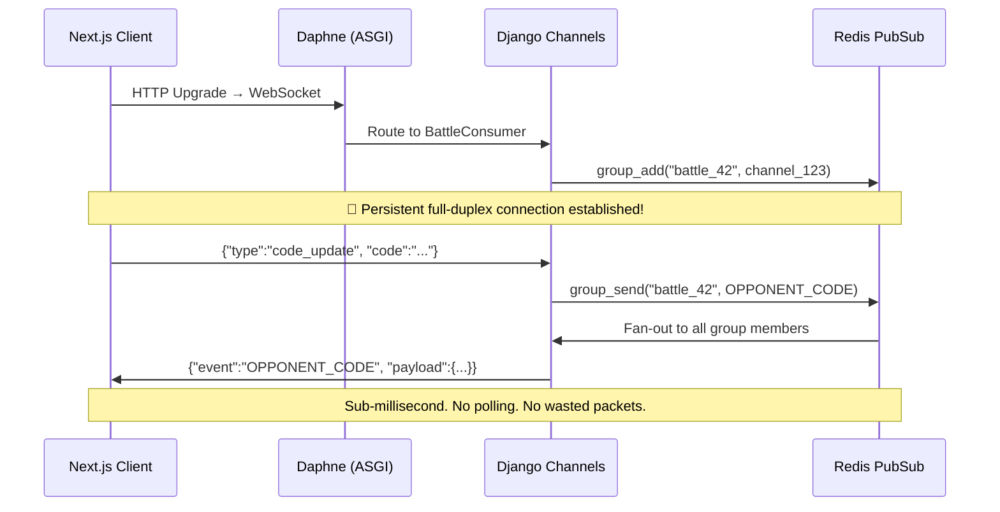
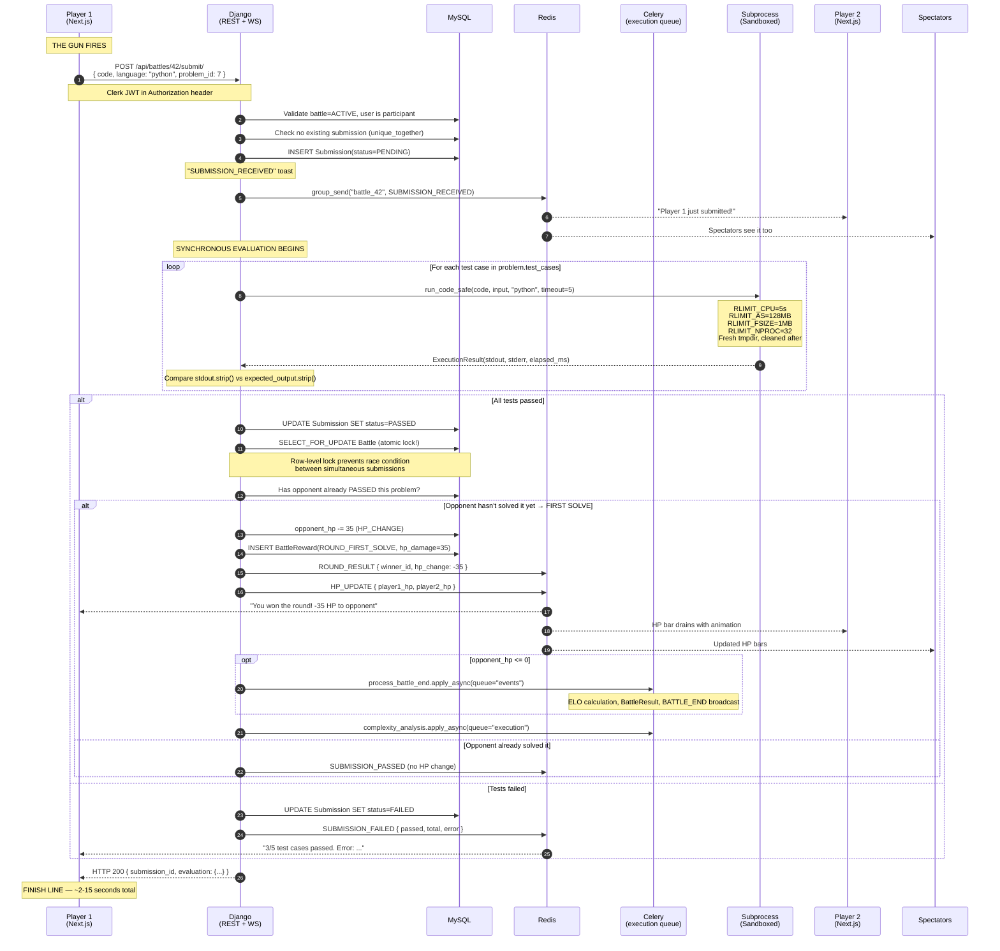
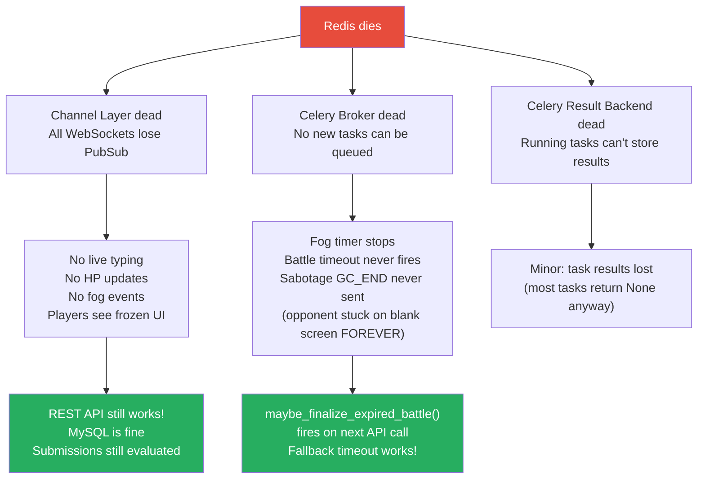
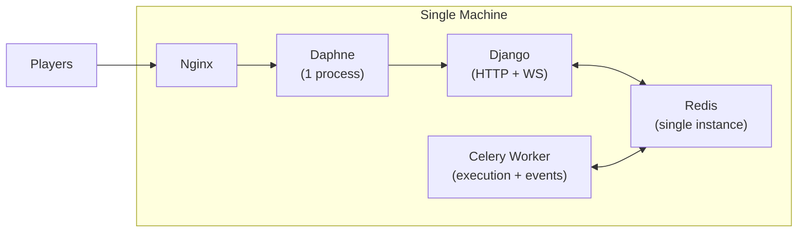
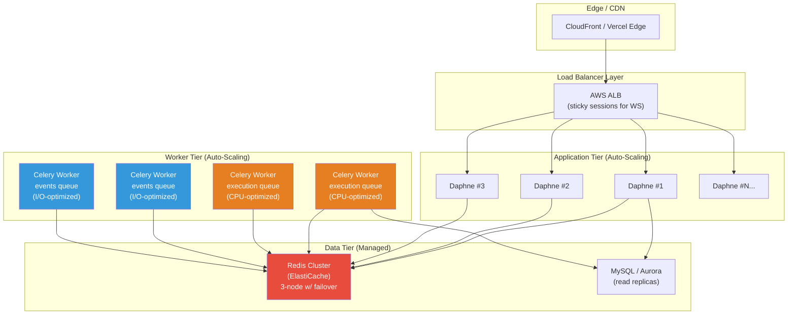

# System Design of BigOff

---

## Table of contents

| Act | Quest | Description |
|-----|-------|-------------|
| I | **The Origin Story** | The Battle of the Protocols |
| II | **Anatomy of the Beast** | Folder map |
| III | **The Packet's Sprint** | The 100m Olympic dash of a code submission |
| IV | **The Boss Fight** | Redis catches fire at 10,000 users |
| V | **The Forbidden Technique** | From local gym to global stadium |

---

# ACT I: THE ORIGIN STORY
> The Battle of the Protocols

Now imagine trying to run BigOff on plain old HTTP REST.

Every time Player 1 wants to know if Player 2 submitted code, he has to send a letter to the post office, wait for the mailman, and hope the reply comes back before the battle's over. That's HTTP polling:

```
Client: "Hey server, did anything happen?"       ← GET /api/battles/42/state/
Server: "Nope."                                  ← 200 OK {}

(300ms later...)

Client: "How about now?"                         ← GET /api/battles/42/state/
Server: "Still no."                              ← 200 OK {}

(300ms later... × 600 times per 3 minutes...)
```

At 10 req/sec × 2 players × 1,000 concurrent battles = 20,000 HTTP requests per second, just for status checks. 

But it gets worse when we factor in live code streaming, hp updates, fog of war, garbage collection sabotages, spectator emotes.

### WebSockets + Daphne (the solution)



**Why Daphne specifically?** [asgi.py](file:///c:/Users/HOME/Desktop/programming/arena/backend/config/asgi.py) tells the whole story:

```python
application = ProtocolTypeRouter({
    "http": django_asgi_app,        # ← REST still works for stateless stuff
    "websocket": JWTAuthMiddlewareStack(   # ← The NEW hotness
        URLRouter(
            battles.routing.websocket_urlpatterns      # ws/battles/<id>/
            + spectators.routing.websocket_urlpatterns  # ws/battles/<id>/spectate/
            + dashboard.routing.websocket_urlpatterns   # ws/lobby/
        )
    ),
})
```

**Daphne** is an ASGI server: it speaks the *async* protocol. Regular Django's `runserver` uses WSGI (synchronous) and can only handle HTTP. It cannot hold a WebSocket connection open.

### The Three WebSocket Consumers

| Consumer | File | Channel Group | Purpose |
|----------|------|--------------|---------|
| [BattleConsumer](file:///c:/Users/HOME/Desktop/programming/arena/backend/battles/consumers.py) | `battles/consumers.py` | `battle_{id}` | Live typing, HP updates, fog, GC, round results |
| [SpectatorConsumer](file:///c:/Users/HOME/Desktop/programming/arena/backend/spectators/consumers.py) | `spectators/consumers.py` | `battle_{id}` (shared!) | Emotes, like-counting, spectate-only view |
| [LobbyConsumer](file:///c:/Users/HOME/Desktop/programming/arena/backend/dashboard/consumers.py) | `dashboard/consumers.py` | `user_{id}` + `admin_monitor` | Battle invites, accept/decline notifications |

`SpectatorConsumer` joins the same `battle_{id}` group as `BattleConsumer`. That means HP_UPDATE, ROUND_RESULT, FOG_START events broadcast once and both players AND spectators receive them. Zero duplicate work. 

---

# ACT II: ANATOMY OF THE BEAST

```mermaid
graph TB
    subgraph "THE BRAIN — Django"
        direction TB
        ACCOUNTS["accounts/
        User model, Clerk auth,
        JWT middleware, ELO ranks"]
        BATTLES["battles/
        Battle/Round/Submission models,
        Views (32KB!), Evaluation engine"]
        PROBLEMS["problems/
        Problem model, test_cases JSON,
        import_problems command"]
        SABOTAGE["sabotage/
        GC sabotage move,
        HP cost/deduction"]
        SPECTATORS["spectators/
        Emotes, like counter"]
        DASHBOARD["dashboard/
        Lobby WS, admin monitor,
        invite system handlers"]
    end

    subgraph "THE MUSCLE — Celery"
        direction TB
        EXEC_Q["execution queue
        (concurrency=4)
        CPU-bound work"]
        EVENT_Q["⚡ events queue
        (concurrency=10)
        I/O-bound broadcasts"]

        EXEC_Q --> EVAL_TASK["evaluate_submission
        Run user code in sandbox"]
        EXEC_Q --> COMPLEX["complexity_analysis
        Big-O classification (stub)"]
        EVENT_Q --> FOG["schedule_fog / end_fog
        10s fog every 90s"]
        EVENT_Q --> GC_END["send_gc_end
        Remove blank screen after 5s"]
        EVENT_Q --> BATTLE_END["process_battle_end
        ELO calc, BattleResult"]
        EVENT_Q --> EXPIRE["expire_battle_request
        Auto-expire stale invites"]
    end

    subgraph "THE NERVOUS SYSTEM — Redis"
        direction TB
        CHANNEL["Channel Layer
        (channels_redis)
        PubSub for WebSocket groups"]
        BROKER["Celery Broker
        Task queue delivery"]
        RESULT["Celery Result Backend
        Task return values"]
    end

    subgraph "THE FACE — Next.js Frontend"
        direction TB
        LOBBY_PAGE["lobby/page.tsx
        Player list, invite system"]
        BATTLE_PAGE["battle/[id]/page.tsx
        Editors, HP bars, timers"]
        SPECTATE_PAGE["spectate/page.tsx
        Live battles list"]
        SPECTATE_DETAIL["spectate/[id]/page.tsx
        Watch live, emote, like"]
    end

    BRAIN_OUT["Django"] --> CHANNEL
    BRAIN_OUT --> BROKER
    MUSCLE_OUT["Celery Workers"] --> CHANNEL
    MUSCLE_OUT --> RESULT
    FACE_OUT["Next.js"] -->|REST API| BRAIN_OUT
    FACE_OUT -->|WebSocket| CHANNEL

    style EXEC_Q fill:#e74c3c,color:#fff
    style EVENT_Q fill:#3498db,color:#fff
    style CHANNEL fill:#e74c3c,color:#fff
    style BROKER fill:#e74c3c,color:#fff
    style RESULT fill:#e74c3c,color:#fff
```



### THE BRAIN — Django (7 apps, ~95KB of Python)

This is the decision-maker. It handles:

| App | LOC | Responsibility |
|-----|-----|---------------|
| [config/](file:///c:/Users/HOME/Desktop/programming/arena/backend/config/settings.py) | ~250 | Settings, ASGI entry, Celery init, URL routing |
| [accounts/](file:///c:/Users/HOME/Desktop/programming/arena/backend/accounts/models.py) | ~460 | User model (ELO rating 800→Legendary, Clerk SSO, roles) |
| [battles/](file:///c:/Users/HOME/Desktop/programming/arena/backend/battles/views.py) | ~1,800 | 14 API views, WS consumer, evaluation, execution |
| [problems/](file:///c:/Users/HOME/Desktop/programming/arena/backend/problems/models.py) | ~120 | Problem model with hidden `test_cases` JSON, import management command |
| [sabotage/](file:///c:/Users/HOME/Desktop/programming/arena/backend/sabotage/views.py) | ~190 | Garbage Collection move, costs 80 HP, blanks opponent screen 5s |
| [spectators/](file:///c:/Users/HOME/Desktop/programming/arena/backend/spectators/consumers.py) | ~100 | Watch live, emote, like-counter |
| [dashboard/](file:///c:/Users/HOME/Desktop/programming/arena/backend/dashboard/consumers.py) | ~200 | Lobby WebSocket, invite dispatch, admin monitoring |

> [!IMPORTANT]
> **The `battles/` app is your 800-lb gorilla.** `views.py` alone is **859 lines / 32KB**. It contains: `CreateBattleView`, `BattleRequestListCreateView`, `BattleRequestAcceptView`, `BattleRequestDeclineView`, `BattleRequestCancelView`, `MyActiveBattleView`, `BattleStateView`, `BattleResignView`, `BattleEndedSummaryView`, `LiveBattlesListView`, `PublicBattleStateView`, `BattleProblemReviewView`, `SubmitSolutionView`, `RunSolutionView` and more. This file is doing deadlifts AND cardio. Consider splitting it.

### THE MUSCLE — Celery (Two Specialized Queues)

Your [celery.py](file:///c:/Users/HOME/Desktop/programming/arena/backend/config/celery.py) sets up a beautifully separated dual-queue system:

```python
# From settings.py — this is EXACTLY how pros do it:
CELERY_TASK_ROUTES = {
    'battles.tasks.evaluate_submission':  {'queue': 'execution'},  # CPU-heavy
    'battles.tasks.complexity_analysis':  {'queue': 'execution'},  # CPU-heavy
    'battles.tasks.schedule_fog':         {'queue': 'events'},     # Fast I/O
    'battles.tasks.end_fog':              {'queue': 'events'},     # Fast I/O
    'battles.tasks.send_gc_end':          {'queue': 'events'},     # Fast I/O
    'battles.tasks.process_battle_end':   {'queue': 'events'},     # Fast I/O
    'battles.tasks.battle_timeout':       {'queue': 'events'},     # Fast I/O
}
```

**Why two queues?** Because `evaluate_submission` runs untrusted user code in a subprocess with `RLIMIT_*` resource limits — it's **CPU-bound and dangerous.** If you put fog timers in the same queue, a player's infinite loop would block ALL fog events across the entire system. Separation of duties = survival.

> [!NOTE]
> `execution` queue: **concurrency=4** — CPU-bound code evaluation with subprocess sandboxing
> `events` queue: **concurrency=10** — lightweight WebSocket broadcasts, timer events, I/O work

### THE NERVOUS SYSTEM — Redis (Triple Duty)

Redis does **three jobs** simultaneously from a single instance at `redis://127.0.0.1:6379/0`:

1. **Channel Layer** (`channels_redis`) — PubSub backbone for all WebSocket group messaging. When Celery broadcasts `HP_UPDATE`, it goes Redis → every connected browser.
2. **Celery Broker** — Task queue. When `evaluate_submission.apply_async()` is called, the task payload is pushed to Redis, and a Celery worker pops it.
3. **Celery Result Backend** — Stores task return values (though your tasks mostly return `None`).

> [!WARNING]
> This is your **single point of failure.** If Redis goes down, ALL three systems collapse simultaneously. We'll address this in Act IV.

---

# ACT III: THE PACKET'S SPRINT
## *Life of a Code Submission 

Let's follow a single code submission from the moment Player 1 clicks **"Submit"** to the moment Player 2 sees their HP bar drain. This is a play-by-play, narrated like a sports broadcast.



### The Sprint Breakdown — What Happens When

| Phase | Duration | What's Happening |
|-------|----------|-----------------|
| **🏁 Starting Blocks** (Step 1) | ~5ms | HTTP POST leaves the browser via `useApiClient()` Axios interceptor with Clerk JWT |
| **🎫 Gate Check** (Steps 2-4) | ~10ms | Django validates auth, battle status, uniqueness constraint |
| **📢 Toast** (Steps 5-7) | ~3ms | `SUBMISSION_RECEIVED` broadcasted via Redis PubSub |
| **🔬 The Main Event** (Steps 8-10) | **1-15 sec** | Code runs in sandboxed subprocess. THIS is the bottleneck. |
| **⚔️ The Kill Shot** (Steps 11-18) | ~15ms | Atomic DB transaction, HP deduction, reward creation, multi-event broadcast |
| **🏁 Finish Line** (Step 19) | ~2ms | HTTP response returns to browser |

> [!IMPORTANT]
> **Critical Design Decision**: You evaluate submissions **synchronously** inside `SubmitSolutionView.post()` rather than dispatching to Celery. This means the HTTP response carries the full evaluation result — the frontend gets instant feedback. The tradeoff? The Django worker thread is blocked for ~5-15 seconds per submission. BUT — since battles are 1v1 (only 2 submitters max), this is perfectly acceptable at your scale. Celery's `evaluate_submission` task exists as an async alternative but isn't used for the primary submit path.

### The Fog of War Timer — Self-Rescheduling Celery Task

This is a clever pattern in your [tasks.py](file:///c:/Users/HOME/Desktop/programming/arena/backend/battles/tasks.py#L73-L94):

```python
@shared_task(queue="events", name="battles.schedule_fog")
def schedule_fog(battle_id: int) -> None:
    battle = Battle.objects.get(id=battle_id)
    if battle.status != Battle.Status.ACTIVE:
        return  # ← STOP condition: battle is over

    _broadcast(battle.id, "FOG_START", {...})       # ← Fire fog NOW
    end_fog.apply_async((battle.id,), countdown=10) # ← End fog in 10s
    schedule_fog.apply_async((battle.id,), countdown=90) # ← RE-FIRE in 90s!
```

It's a **self-replicating task** — every 90 seconds it spawns a copy of itself. The guard clause `if battle.status != ACTIVE: return` is the kill switch that stops the recursion when the battle ends.

---

# ACT IV: THE BOSS FIGHT
## *Redis Catches Fire at the Grand Finale*

### The Scenario

It's the **Grand Finals.** 10,000 spectators. Two top-ranked players. And your single Redis instance on `127.0.0.1:6379` just went **poof.** 💀

### What Happens — The Cascade of Doom



### Your EXISTING Defenses

> [!TIP]
> You already have more resilience than you think. Let me show you:

**1. Graceful Degradation on WS Failure**
Every `channel_layer.group_send()` call in your views is wrapped in `try/except`:
```python
# From views.py — you do this EVERYWHERE:
try:
    channel_layer = get_channel_layer()
    if channel_layer:
        async_to_sync(channel_layer.group_send)(...)
except Exception:
    pass  # Don't fail the submission if WS is down
```
**Verdict**: REST API and database mutations continue working even with Redis dead. Submissions still get evaluated and saved. *Solid.*

**2. Wall-Clock Backup Timer**
Your [maybe_finalize_expired_battle()](file:///c:/Users/HOME/Desktop/programming/arena/backend/battles/tasks.py#L213-L242) function checks `ends_at` against the current wall clock on every API request. Even if Celery's `process_battle_end` task never fires, the battle STILL ends when any participant makes their next API call. Brilliant failsafe.

**3. Idempotent Battle Finalization**
```python
updated = Battle.objects.filter(
    id=battle_id, status=Battle.Status.ACTIVE,
).update(status=Battle.Status.COMPLETED)
if updated == 0:
    return  # Already ended by another trigger — exit.
```
Uses `filter().update()` — an atomic SQL operation. Even if Redis recovers and fires the Celery timeout task AFTER the HTTP fallback already ended the battle, it's a no-op. No double-counting ELO. No duplicate `BattleResult`. *Professional-grade idempotency.*

**4. Atomic HP Deduction**
```python
with transaction.atomic():
    battle = Battle.objects.select_for_update().get(id=battle.id)
    # ... HP -= 35 ...
```
`SELECT ... FOR UPDATE` = row-level lock in MySQL. Two simultaneous submissions can't both claim "first solve." *Race condition eliminated.*


| Vulnerability | Severity | Details |
|--------------|----------|---------|
| **Single Redis SPOF** | 🔴 Critical | One instance, one host. No replication, no sentinel, no cluster. |
| **Fog recurrence leak** | 🟠 High | `schedule_fog` re-schedules itself every 90s. If a battle ends but the task is already queued, it wastes cycles. Guard clause catches it, but the tasks still accumulate in the queue for dead battles. |
| **In-memory rate limiter** | 🟠 High | `_run_rate` in [views.py](file:///c:/Users/HOME/Desktop/programming/arena/backend/battles/views.py#L48-L66) uses a Python `dict` with a `threading.Lock`. This resets on every Daphne restart and doesn't share across multiple workers/processes. |
| **No JWT signature verification** | 🔴 Critical | `jwt.decode(token, options={"verify_signature": False})` in [authentication.py](file:///c:/Users/HOME/Desktop/programming/arena/backend/accounts/authentication.py#L54). Anyone can forge a JWT. This is OK for development but **catastrophic in production.** |
| **Subprocess sandbox (no Docker)** | 🟡 Medium | [execution.py](file:///c:/Users/HOME/Desktop/programming/arena/backend/battles/execution.py) uses `RLIMIT_*` but no namespace isolation, no seccomp, no network disablement. A crafty user could read `/etc/passwd` or probe localhost. |
| **Synchronous eval blocks workers** | 🟡 Medium | A 5-second TLE on every test case × many test cases = Django thread blocked for 30+ seconds. Under load, you run out of ASGI worker threads. |

### Hardening Prescriptions -

```
┌─────────────────────────────────────────────────────┐
│  PRESCRIPTION #1: Redis High Availability           │
│                                                     │
│  Redis Sentinel (3-node) or AWS ElastiCache         │
│  with automatic failover.                           │
│                                                     │
│  settings.py already has the breadcrumb:            │
│  REDIS_URL = os.getenv("REDIS_URL", "...")          │
│  # comment: "change this to ElastiCache endpoint"   │
│                                                     │
│  Your infrastructure is DESIGNED for this swap.     │
└─────────────────────────────────────────────────────┘

┌─────────────────────────────────────────────────────┐
│  PRESCRIPTION #2: Verify JWT Signatures             │
│                                                     │
│  Fetch Clerk's JWKS at startup:                     │
│  jwt.decode(token, key=CLERK_PUBLIC_KEY,            │
│             algorithms=["RS256"])                   │
│                                                     │
│  Cost: ~0.3ms per request. Security: PRICELESS.     │
└─────────────────────────────────────────────────────┘

┌─────────────────────────────────────────────────────┐
│  PRESCRIPTION #3: Move Rate Limiter to Redis        │
│                                                     │
│  Replace _run_rate dict with Redis INCR + EXPIRE:   │
│  key = f"run_rate:{user_id}:{battle_id}"            │
│  pipe: INCR key, EXPIRE key 60                      │
│                                                     │
│  Survives restarts. Shared across workers.          │
└─────────────────────────────────────────────────────┘

┌─────────────────────────────────────────────────────┐
│  PRESCRIPTION #4: Container-Based Code Execution    │
│                                                     │
│  Replace subprocess + RLIMIT with:                  │
│  - Docker/Podman containers (disposable per run)    │
│  - OR nsjail/firejail for lightweight sandboxing    │
│  - Network disabled (--network=none)                │
│  - Read-only filesystem                             │
│  - No access to host process tree                   │
└─────────────────────────────────────────────────────┘
```

---

# ACT V: THE FORBIDDEN TECHNIQUE 🥷
## *From Local Gym to Global Stadium — Horizontal Scaling*

You asked for **one industry-standard secret move.** I'll give you the one that turns your single-server Arena into a platform that could host a 100,000-player tournament across continents.

### The Technique: **Horizontally-Scaled Worker Pool with Queue-Based Load Distribution**

Right now, your architecture looks like this:



**One Daphne. One Celery worker. One Redis. One MySQL.** That's a dojo with one sparring ring.

### The Transformation



### Why This Works With ZERO Code Changes

| Feature | Why It Already Works |
|---------|---------------------|
| **Redis as central bus** | All Daphne instances connect to the same Redis. `channel_layer.group_send("battle_42", ...)` reaches every connected client regardless of which Daphne they're on. |
| **Celery queue separation** | `execution` and `events` already have separate queues. Spin up CPU-optimized machines for `execution` workers and cheap I/O-optimized ones for `events`. Scale independently. |
| **Stateless Django** | No session-sticky state in memory (except that rate limiter — move it to Redis). All state lives in MySQL/Redis. Any Daphne instance can serve any request. |
| **`select_for_update()` locks** | Database-level locking means multiple Celery workers can't corrupt HP or create duplicate rewards, even with 50 workers running in parallel. |
| **Idempotent finalization** | `filter(status=ACTIVE).update(status=COMPLETED)` — if two workers both try to end the same battle, exactly one succeeds. |

### The Specific Scaling Playbook

```
SCALING RECIPE — "The Arena Amplifier"

STEP 1: Deploy Redis Cluster (ElastiCache)
  └─ You ALREADY have REDIS_URL as an env var
  └─ Point it to ElastiCache primary — done

STEP 2: Run multiple Daphne instances behind ALB
  └─ daphne -b 0.0.0.0 -p 8000 config.asgi:application
  └─ ALB with WebSocket sticky sessions
  └─ Auto-scale on CPU/connection count

STEP 3: Separate Celery worker pools
  └─ Execution workers (c5.xlarge, CPU-heavy):
     celery -A config worker -Q execution -c 4
  └─ Event workers (t3.medium, I/O-light):
     celery -A config worker -Q events -c 10
  └─ Auto-scale on queue depth

STEP 4: MySQL → Aurora with read replicas
  └─ Write to primary, read from replicas
  └─ Django DATABASE_ROUTERS for read/write split

STEP 5: Next.js → Vercel / CloudFront
  └─ Static assets cached at edge
  └─ API routes proxied to ALB
```

> [!NOTE]
> **The key insight**: Your dual-queue Celery architecture (`execution` vs `events`) is the exact pattern used by LeetCode, HackerRank, and Codeforces at production scale. The `execution` workers run untrusted code — they need CPU isolation, security hardening, and careful resource limits. The `events` workers just push JSON to Redis, they can be tiny, cheap, and numerous.

---

## Architecture Scorecard

| Dimension | Grade | Notes |
|-----------|-------|-------|
| **Real-time Architecture** | ⭐⭐⭐⭐⭐ | WebSocket groups, channel layer, event-driven — textbook |
| **Queue Design** | ⭐⭐⭐⭐⭐ | Dual-queue with routing — production-grade thinking |
| **Concurrency Safety** | ⭐⭐⭐⭐ | `select_for_update()`, idempotent finalization, atomic ops |
| **Fault Tolerance** | ⭐⭐⭐ | Good app-level fallbacks, but SPOF on Redis and no container sandbox |
| **Security** | ⭐⭐ | JWT not verified, subprocess not isolated, in-memory rate limiter |
| **Scalability Readiness** | ⭐⭐⭐⭐ | Stateless design, env-var config, queue separation — ready to scale with minimal changes |
| **Code Organization** | ⭐⭐⭐ | Clean app separation, but `battles/views.py` (859 lines) is doing too much heavy lifting |

Now go run `redis-server` and get back to shipping.


## Submission Flow (healthy path)
User clicks Submit
    → POST /api/battles/{id}/submit/ (fetchWithAuth.ts)
      → SubmitSolutionView.post (views.py:635)
        → Submission created with total_cases = len(problem.test_cases)
        → evaluate_submission_sync(submission.id) (evaluation.py:35)
          → run_code_safe() per test case (execution.py)
          → passed/failed count computed
          → Submission saved → status=PASSED or FAILED
          → _broadcast() → WebSocket → battle room
        → Response: {submission_id, evaluation}
    → sessionStorage.setItem(evaluation)
    → router.push /battle/{id}/review/{problemId}

  Review page loads
    → GET /api/battles/{id}/problems/{problemId}/review/
    → BattleProblemReviewView.get (views.py:559)
    → Returns both players' submission payloads (passed_cases, total_cases, code, status)
    → sessionStorage eval used for instant display before API returns