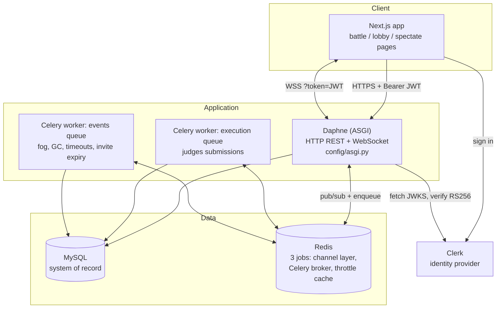
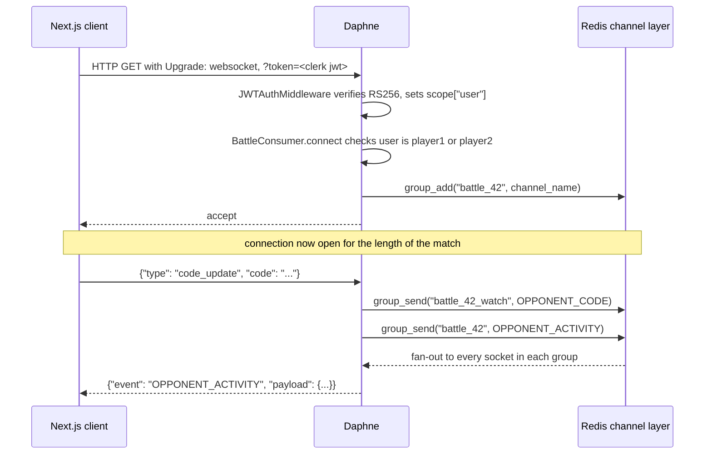
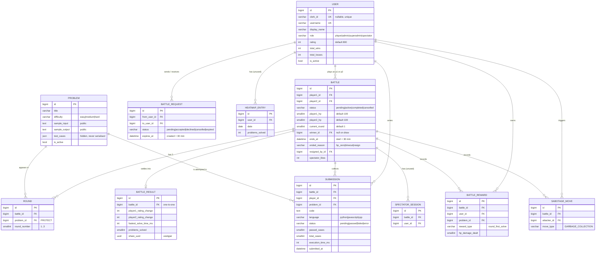
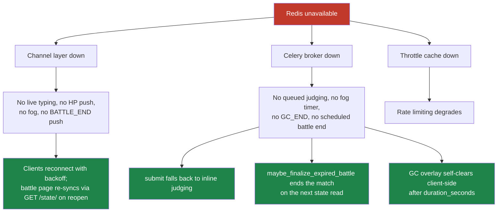
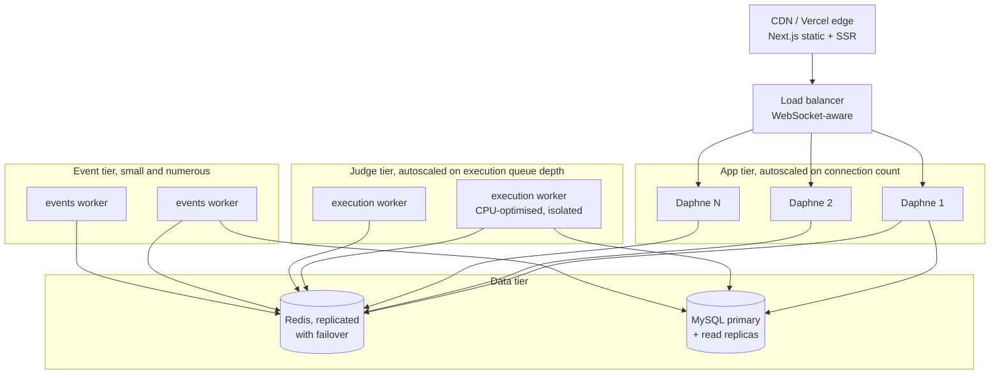

# Architecture of BigOff

A real-time 1v1 competitive coding arena. Two players, three problems, thirty minutes, one HP bar each.

This document exists so that you can explain the system rather than describe it. Describing is *"there is a Django backend and a Next.js frontend."* Explaining is *"here is the force that shaped this piece, here is what I gave up, here is where it breaks."* Everything below is traceable to a file in this repo, and where something is unimplemented or wrong it says so out loud.

Read it in order the first time. After that, Part 10 (the decisions ledger) and Part 13 (the drill) are the night-before pages.

---

## Table of contents

| Part | Title | The question it answers |
|------|-------|-------------------------|
| 1 | The shape of the problem | What is actually hard here? |
| 2 | The processes | What is running, and why that many? |
| 3 | Why a persistent connection | Why not just poll? Show the arithmetic. |
| 4 | The data model | What are the tables, and why these columns? |
| 5 | Life of a submission | What happens between the click and the HP bar draining? |
| 6 | Correctness under concurrency | What happens when both players solve at the same instant? |
| 7 | The trust boundary | Who are you, and how do we run your code without dying? |
| 8 | When things break | Redis dies. Now what? |
| 9 | Scaling | What is stateless, what is not, and where is the wall? |
| 10 | The decisions ledger | Chose X over Y, because Z, at the cost of W. |
| 11 | The DDIA map | Where does this sit in the book's vocabulary? |
| 12 | Dead weight and known gaps | What is in the schema that nothing uses. |
| 13 | The interview drill | Questions and rehearsed answers. |

---

# Part 1: The shape of the problem

Start with the product, because the architecture is downstream of it.

Two authenticated players enter a battle. The battle contains three problems, one easy, one medium, one hard, drawn at random at match creation (`battles/views.py:86-99`). Both players see all three at once. There is no turn taking. Each player has 100 HP. The first player to pass every hidden test case on a given problem removes 35 HP from the other (`ROUND_DAMAGE` in `battles/evaluation.py:23`). The match ends when someone hits 0 HP, when someone resigns, or when 30 minutes elapse, whichever comes first. Whoever has more HP at the end wins, and both ratings move by ELO.

Notice the arithmetic that falls out of those constants: three problems, 35 damage each, is 105 damage available to a single player against a 100 HP pool. So a clean sweep is exactly enough for a knockout, and no more. The numbers were chosen so the game can actually end inside its problem budget.

Three properties make this harder than a CRUD app, and everything in this architecture is a response to one of them.

### Property 1: it is a shared-state, low-latency, two-writer system

Both players write to the same battle row. HP is a contested resource. If both players finish the same problem within the same few milliseconds, exactly one must be awarded the damage. A leaderboard app never has to resolve this; a game does. This is where Part 6 comes from.

### Property 2: the interesting events do not originate from the client asking

The opponent's HP dropping, the fog of war rolling in, a garbage-collection sabotage blanking your editor, the match clock expiring. None of these are caused by *your* action, so a pure request/response model has no way to tell you about them except by making you ask repeatedly. This is where Part 3 comes from.

### Property 3: the system runs code written by adversaries

Every submission is arbitrary, attacker-controlled code that gets executed on your hardware. It can fork bombs, allocate infinitely, spin forever, read the filesystem, and open sockets. It is also slow: compilation plus N test cases takes seconds, not milliseconds. This is where Parts 5, 7 and 9 come from.

Everything else is bookkeeping.

---

# Part 2: The processes

Four long-lived processes and two data stores. This is the picture to sketch on a whiteboard first.



### Why Daphne and not `runserver`

Django's classic deployment target is WSGI, which is a synchronous, one-request-one-thread protocol. It has no vocabulary for a connection that stays open. Daphne is an ASGI server, and ASGI models a connection as a stream of events, so it can hold a WebSocket open for the length of a 30 minute battle.

`config/asgi.py` is the fork in the road, and it is worth quoting because it is the shortest possible statement of the whole design:

```python
application = ProtocolTypeRouter({
    "http": django_asgi_app,                  # REST, stateless, unchanged
    "websocket": JWTAuthMiddlewareStack(      # live game state
        URLRouter(
            battles.routing.websocket_urlpatterns
            + spectators.routing.websocket_urlpatterns
            + dashboard.routing.websocket_urlpatterns
        )
    ),
})
```

Two protocols, one process, one codebase, one set of models. Requests that are naturally request/response (fetch battle state, submit code, accept an invite) stay REST. Anything the server needs to volunteer goes over the socket.

### Why two Celery queues and not one

Because the two kinds of background work have opposite resource profiles, and mixing them means the cheap work starves behind the expensive work.

| Queue | Task | Profile | Right machine |
|-------|------|---------|---------------|
| `execution` | `battles.evaluate_submission` | CPU-bound, seconds per job, runs untrusted code | CPU-optimised, hardened, isolated |
| `events` | fog, GC end, battle timeout, invite expiry | I/O-light, milliseconds per job, mostly a Redis publish | Small and numerous |

The routing is explicit in `config/settings.py`:

```python
CELERY_TASK_ROUTES = {
    "battles.evaluate_submission": {"queue": "execution"},
    "battles.schedule_fog":        {"queue": "events"},
    "battles.end_fog":             {"queue": "events"},
    "battles.send_gc_end":         {"queue": "events"},
    "battles.process_battle_end":  {"queue": "events"},
    "battles.expire_battle_request": {"queue": "events"},
}
```

There is a comment in that file worth remembering, because it is the kind of detail interviewers like: the keys must match the `name=` given to each `@shared_task`, not the dotted module path. An earlier version used `battles.tasks.*` keys, which matched nothing, so every task silently landed on the default queue and the separation did not exist.

Also note `CELERY_WORKER_PREFETCH_MULTIPLIER = 1`. By default a Celery worker greedily reserves a batch of messages. For jobs that take 5 seconds each, that means one worker can sit on a queue of submissions it will not start for half a minute while another worker idles. Prefetch of 1 makes the queue behave like a real work-stealing queue.

### Why Redis is doing three jobs

Redis is the channel layer (`CHANNEL_LAYERS`), the Celery broker and result backend (`CELERY_BROKER_URL`), and the shared cache backing DRF's rate limiter (`CACHES`). One dependency, three responsibilities.

That last one is not an accident of convenience. DRF's throttling stores its counters in the Django cache. With the default `LocMemCache`, every worker process keeps its own counters, so a limit of "20 runs per minute" silently becomes "20 per minute per process." Pointing the cache at Redis is what makes the number mean what it says.

The cost of the triple duty is a single, load-bearing point of failure, which Part 8 walks through honestly.

---

# Part 3: Why a persistent connection

The instinct is to say "WebSockets because real-time." That is not an argument. Here is the argument.

### The polling version, priced out

Suppose we drop WebSockets and let the client poll `GET /api/battles/42/state/` every 300ms so that HP changes feel responsive.

```
per client:    1 / 0.3s            = 3.33 requests/second
per battle:    3.33 x 2 players    = 6.7 requests/second
1,000 battles: 6.7 x 1,000         = 6,700 requests/second
```

Roughly 6,700 requests per second, before a single spectator has joined, and each one runs auth, a JWKS-cached signature verification, and a `SELECT` with joins on `player1`, `player2` and `rounds__problem`. The overwhelming majority return a state identical to the last one.

Now add spectators. At 20 watchers per battle you are at 20,000 clients, roughly 67,000 requests per second, and spectators want live *code*, which changes several times a second. Polling cannot deliver a keystroke stream at all; it can only deliver stale snapshots faster.

And there is a floor you cannot poll your way past: at a 300ms interval, the average delay between an event happening and the client learning about it is 150ms, worst case 300ms, entirely wasted latency in a game where two people are racing each other.

### The push version

With a socket, the server sends when something happens and is otherwise silent. The client pays one connection, plus a 25 second ping to keep intermediaries from reaping the connection (`PING_INTERVAL_MS` in `frontend/lib/useReconnectingSocket.ts`).



The channel layer is the piece that makes this work across processes. `group_send` publishes to Redis; every Daphne process subscribed to that group receives it and writes to its own sockets. That indirection is why the design scales horizontally without changes, and Part 9 leans on it.

### The three consumers, and the group split that is actually a security control

| Consumer | File | Groups joined | Who is allowed in |
|----------|------|---------------|-------------------|
| `BattleConsumer` | `battles/consumers.py` | `battle_<id>` | The two participants only; anyone else closed with 4403 |
| `SpectatorConsumer` | `spectators/consumers.py` | `battle_<id>_watch` | Any signed-in user who is *not* a participant |
| `LobbyConsumer` | `dashboard/consumers.py` | `user_<id>`, plus `admin_monitor` if staff | Any signed-in user, for their own channel |

The two battle groups are defined in `battles/events.py`, and the reason they are separate is the single most interesting security decision in the codebase.

Spectators are supposed to watch the code being typed. The opponent absolutely is not. When both audiences shared one group, a player could open the public spectate page for their own match in a second tab and read their opponent's solution keystroke by keystroke. The blur the battle UI applied was cosmetic, and the spectate page did not even have that.

So the fan-out is asymmetric:

```python
# battles/consumers.py, on receiving code_update
# opponent gets a non-reversible summary
group_send(player_group, {"event": "OPPONENT_ACTIVITY",
                          "payload": {"player_id": ..., **code_activity(code)}})
# spectators get the real buffer
group_send(spectator_group, {"event": "OPPONENT_CODE",
                             "payload": {"player_id": ..., "code": code}})
```

`code_activity` returns `{chars, lines, non_empty_lines}`. Enough to render "they are typing, they have written a lot," and not enough to reconstruct anything.

The residual risk is documented in the consumer's own docstring, which is the right way to handle a partial fix: a determined player can still watch from a second account. Closing that properly means putting the spectator stream on a broadcast delay, the way real esports do. What exists today removes the one-click version, not the motivated version.

Two more input-hardening details on that path, both of which matter because a WebSocket frame is unauthenticated user input that never passes through DRF:

- `MAX_CODE_CHARS = 200 * 1024` and `MAX_CHAT_CHARS = 500` cap what a client can push into the channel layer. Without them one socket can stream an unbounded buffer into Redis.
- The spectator consumer stamps the username server-side rather than trusting the payload, and rate limits likes to one per second and emotes to two per second per socket. A like is a database `UPDATE`; without a cap, one socket drives unbounded writes.

---

# Part 4: The data model

Ten tables. MySQL is the system of record for everything that must survive a restart; Redis holds nothing durable.



### Reading the model: three ideas, then the details

Idea one: `Battle` is a mutable game-state row, and everything hanging off it is an append-only log. HP changes in place. `Submission`, `BattleReward` and `SabotageMove` are never updated after the fact, they are only inserted. That split is what makes the system auditable: you can always reconstruct why HP is where it is by replaying the rewards and sabotages, even though the current value is denormalised onto the battle.

Idea two: `Round` is a join table with a scoreboard bolted on. Its real job is to answer "is problem 7 part of battle 42," which every submit and run endpoint asks before touching anything (`Round.objects.filter(battle=battle, problem=problem).exists()`). That check is a genuine authorisation boundary, not a nicety: without it a player could submit against any problem in the database and farm rewards.

Idea three: identity is federated. `User` has no usable password path. `clerk_id` is the real primary identity and the local integer `id` is just a convenience for foreign keys.

### Column-level reasoning worth being able to defend

`Battle.player1_hp` and `player2_hp` are denormalised. The truthful value is `100 - sum(BattleReward.hp_damage_dealt against you) - 15 * (your sabotage uses)`. Storing it means every read of the battle state is one row instead of an aggregate over two tables, and battle state is the hottest read in the system. The cost is that two sources of truth can drift, which is exactly why every write to HP happens under the same row lock as the log insert (Part 6). If they ever disagree, the log wins and the counter is the bug.

`Battle.ends_at` is a materialised deadline rather than a computed `created_at + 30 minutes`. That is what makes the wall-clock fallback in Part 8 possible: any process can ask "is this battle over" with a single indexed comparison, without knowing the duration rule.

`Problem.test_cases` is a `JSONField`, not a `TestCase` table. The reasoning is access pattern. Test cases are only ever read as a complete set, by exactly one caller, immediately before executing them (`evaluation._run_test_cases` iterates the whole list). They are never queried individually, never joined, never filtered. A relational table would buy indexing and constraints that nothing would use, and cost a second query on the hot judge path. The real cost of the JSON choice is that nothing validates the shape: a problem imported with the wrong key names is undetectably broken until a submission comes in, at which point `total == 0` and the code has to defend itself explicitly:

```python
if total == 0:
    logger.error("Problem %s has no test cases, cannot judge", problem.id)
    Submission.objects.filter(id=submission_id).update(status=Submission.Status.ERROR)
```

`Problem.test_cases` is also never serialised. `ProblemSerializer` exposes the sample input and output only. Hidden cases live server-side and leave the process only as stdin to a sandboxed child.

`Submission` deliberately has no unique constraint on `(battle, player, problem)`, and the model carries a comment explaining why, which is the single best example in this codebase of a constraint being wrong for product reasons rather than technical ones. With a three-problem pool, one failed attempt used to lock a player out of that problem for the entire match, so a typo could eliminate someone. Retries are allowed. Scoring counts only the first *passing* submission, and the uniqueness that actually matters is enforced by `BattleReward` plus a row lock instead.

`User.rating` starts at 800 and moves by ELO with a K-factor that decreases with skill: 32 below 2100, 24 below 2400, 16 above (`battles/utils.py`). Lower K at the top is standard practice, and the justification is a statistical one: a high rating is backed by more games, so each new game should be weaker evidence.

### Indexes, and what each one is actually for

| Table | Index | The query it exists for |
|-------|-------|-------------------------|
| `Battle` | `(status, -created_at)` | The live-battles list for the spectate lobby, which is unauthenticated and public |
| `Battle` | `(status, ends_at)` | The expiry sweep: find active battles past their deadline |
| `Submission` | `(battle, problem, status)` | "Has anyone already passed this problem in this battle?" The first-solve check, inside the lock |
| `Submission` | `(battle, player)` | A player's attempts in a match, used by the review page |
| `BattleRequest` | `(to_user, status)` | The notification badge: pending invites for me |
| `BattleRequest` | `(status, expires_at)` | The stale-invite sweep |
| `User` | unique `clerk_id` | Every single authenticated request resolves a JWT subject to a user through this |
| `HeatmapEntry` | unique `(user, date)` | Upsert-per-day, so the counter cannot fork |
| `SpectatorSession` | unique `(battle, user)` | One session row per watcher |

There is also a check constraint, `battle_players_must_differ`, enforcing `player1 != player2` at the database level. The application checks this too, in `_create_battle`. Both layers is correct: the application check produces a good error message, the database check makes the invariant true regardless of which code path writes.

Indexes that are missing and that I would add under load:

- `Submission` has an ordering of `-submitted_at` but no index on it. The review page's "latest submission for this player and problem" does a filesort within the `(battle, player)` range. Fine at three problems per match, not fine as a general submission history.
- `_has_active_battle` filters `status = active AND (player1_id = X OR player2_id = X)`. Neither battle index covers that predicate, so MySQL falls back to an index merge across the two foreign-key indexes. A composite on `(player1_id, status)` and `(player2_id, status)` would serve it directly. This runs on every invite acceptance.

---

# Part 5: Life of a submission

This is the story to tell when someone says "walk me through a request."

```mermaid
sequenceDiagram
    autonumber
    participant P1 as Player 1
    participant API as Daphne / Django
    participant DB as MySQL
    participant R as Redis
    participant W as Celery execution worker
    participant SP as Subprocess
    participant P2 as Player 2 + spectators

    P1->>API: POST /api/battles/42/submit/ {code, language, problem_id}
    Note over P1,API: Authorization: Bearer <clerk session jwt>

    API->>API: throttle scope "submit", 30/min, counter in Redis
    API->>DB: battle is ACTIVE? caller is a participant?
    API->>DB: problem belongs to a Round of this battle?
    API->>DB: already PASSED this problem? -> 400
    API->>DB: a PENDING submission outstanding? -> 409
    API->>DB: INSERT Submission(status=pending, total_cases=len(test_cases))
    API->>R: broadcast SUBMISSION_RECEIVED
    R-->>P2: "opponent just submitted"
    API->>R: enqueue battles.evaluate_submission on "execution"
    API-->>P1: 202 Accepted {submission_id, queued: true}
    Note over P1: request is over in tens of milliseconds

    W->>R: reserve the job (prefetch 1)
    W->>DB: load submission, problem, battle
    Note over W,SP: no transaction open, no locks held
    W->>SP: compile once, then run each test case
    loop per test case, stop at first failure
        SP-->>W: stdout, stderr, exit code, elapsed ms
    end

    W->>DB: BEGIN; SELECT ... FOR UPDATE on battle
    W->>DB: write submission verdict
    alt all passed and nobody else solved this problem first
        W->>DB: opponent_hp = max(0, opponent_hp - 35)
        W->>DB: INSERT BattleReward
    end
    W->>DB: COMMIT
    Note over W,DB: broadcasts happen only after commit

    W->>R: SUBMISSION_PASSED or SUBMISSION_FAILED
    W->>R: ROUND_RESULT + HP_UPDATE if damage was dealt
    R-->>P1: your verdict
    R-->>P2: HP bar drains

    opt opponent HP reached 0
        W->>W: finalize_battle_if_active inline
        W->>DB: claim COMPLETED, apply ELO, INSERT BattleResult
        W->>R: BATTLE_END
    end
```

### The design decision at the centre of this diagram

Judging is asynchronous. The HTTP request returns `202 Accepted` in tens of milliseconds and the verdict arrives later over the socket.

This is the correct call and it is worth being able to defend crisply, because a previous version of this system did it synchronously inside the view and the old design doc describes that version.

Judging cost is bounded by `CELERY_TASK_TIME_LIMIT = 240` seconds, and realistically runs from about 200ms for a fast Python solution to tens of seconds for C++ with a cold filesystem cache, since the compile timeout alone is 45 seconds. Holding an ASGI worker for that is not a performance nitpick, it is a liveness failure: those same worker slots are serving every open WebSocket in the process. A handful of slow submissions and the Daphne process stops delivering HP updates to everybody.

The cost of going async is that the client now needs two ways to learn the answer, and both exist:

1. `SUBMISSION_PASSED` / `SUBMISSION_FAILED` over the battle socket, which is the fast path.
2. `GET /api/battles/<id>/submissions/<sid>/`, a poll, which is the fallback when the socket is down.

And there is a deliberate escape hatch: if enqueueing raises, the view judges inline and returns `200` with the full evaluation rather than failing.

```python
try:
    evaluate_submission.apply_async((submission.id,), queue="execution")
except Exception:
    logger.exception("Could not queue evaluation for %s; judging inline", submission.id)
    queued = False
```

That is a deliberate availability-over-latency trade. With no Redis and no worker, the platform is slow but playable rather than dead. Say that out loud in an interview, because the reflex reading of a synchronous fallback is "you did not think about it."

### Submit versus run

There are two execution endpoints and they are not the same shape.

| | `POST /run/` | `POST /submit/` |
|---|---|---|
| Input | `problem.sample_input`, the public one | all hidden `test_cases` |
| Execution | synchronous, in the request | queued to the `execution` queue |
| Cost | one process, 5 second cap | compile plus N processes |
| Throttle | 20/min | 30/min |
| Consequence | none, no scoring | verdict, damage, possibly ends the match |
| Broadcast | `PLAYER_SAMPLE_RUN` | `SUBMISSION_RECEIVED`, then the verdict |

Run is synchronous because it is a single process against one small input and users expect it to feel like hitting play in an editor. It is the tighter throttle of the two precisely because it is the cheap-to-call, expensive-to-serve path.

### The self-rescheduling timer

Fog of war is a recurring event with no scheduler. The trick is a task that re-enqueues itself:

```python
@shared_task(queue="events", name="battles.schedule_fog")
def schedule_fog(battle_id):
    battle = Battle.objects.get(id=battle_id)
    if battle.status != Battle.Status.ACTIVE:
        return                                   # the kill switch
    _broadcast(battle.id, "FOG_START", {...})
    end_fog.apply_async((battle.id,), countdown=10, queue="events")
    schedule_fog.apply_async((battle.id,), countdown=90, queue="events")
```

First fog fires 90 seconds after the match starts, lasts 10 seconds, and repeats every 90. The status guard is the recursion's base case, and it is the only thing stopping an infinite chain of tasks per battle forever.

This pattern is cheap and requires no beat scheduler, which is its whole appeal. Its weakness is that the chain is only as reliable as the broker: lose the queued message and the fog silently never returns for that match, with nothing to detect the absence. A `celery beat` sweep over active battles would be self-healing instead of self-perpetuating. At one recurring event type, the simple version wins.

---

# Part 6: Correctness under concurrency

This is the part most vibe-coded projects cannot answer, so it is the part most worth knowing cold. There are four genuine races in this system. Each is closed differently, and the differences are the interesting bit.

### Race 1: both players solve the same problem at nearly the same instant

Only one can be first, and 35 HP is on the line.

The naive implementation writes the submission's status first and then checks whether the opponent has already passed. Run that on two threads and interleave them: each writes `PASSED`, then each reads the other's freshly written `PASSED`, and each concludes it was second. Nobody gets the damage. This is a lost-update-style anomaly, and the fix is not "add a transaction," it is *ordering the read and write inside the same critical section*.

```python
with transaction.atomic():
    locked_battle = Battle.objects.select_for_update().get(id=battle.id)   # serialise on the battle row
    submission.save(update_fields=[...])                                   # write verdict INSIDE the lock
    if all_passed and locked_battle.status == Battle.Status.ACTIVE:
        already_solved = Submission.objects.filter(
            battle_id=..., problem_id=..., status=PASSED
        ).exclude(id=submission.id).exclude(player_id=submission.player_id).exists()
        ...
```

`select_for_update()` on the battle row is the serialisation point for the entire match. Every concurrent judge for battle 42 queues behind it, so the two contenders are ordered, and the second one sees the first one's `PASSED` row and correctly declines the reward.

Three things are worth noticing about the shape of this block.

The lock is on `Battle`, not on `Submission`. That is deliberate: the battle row is the contended resource that both players' HP lives on, so locking it also protects against a concurrent sabotage or resignation touching HP at the same time. One lock, one invariant, no lock ordering problem.

The slow work is outside the lock. `_run_test_cases` runs before `transaction.atomic()` is ever entered, and the file says so:

> The sandboxed run happens outside any transaction, it takes seconds, and only the scoring decision is taken under a row lock.

If the subprocess ran inside the transaction, the battle row would be locked for the duration of a compile, and MySQL's `innodb_lock_wait_timeout` would start failing the opponent's judge. Long transaction plus contended row is one of the classic ways to turn a working system into a stalled one.

The broadcasts are after the commit. Sending `HP_UPDATE` from inside the transaction means a client can receive it, immediately `GET` the battle state, and read the pre-commit value, which looks to the user like the HP came back.

### Race 2: the same player solving their own problem twice

Retries are allowed, so a player can submit a passing solution, then submit it again. The `already_solved` check excludes their own submissions, so it would not stop them from being awarded twice. A second guard closes it, using the reward log as the idempotency key:

```python
self_already_rewarded = BattleReward.objects.filter(
    battle_id=..., user_id=submission.player_id, problem_id=problem.id
).exists()
```

This is why `BattleReward` earns its place as a table rather than being a derived number. It is the durable record of "this damage has already been applied," and it is checked under the same lock that applies the damage.

There is also a cheaper guard earlier, in the view: a player who has already passed a problem gets a `400` at submit time, and a player with a `PENDING` submission for that problem gets a `409`. Those are conveniences, not the correctness boundary. They are unlocked reads and two simultaneous requests can both pass them. The real guarantee is the reward check under the lock, which is the right layering: fast rejection at the edge, authoritative decision at the centre.

### Race 3: the battle being ended twice

There are four independent triggers that can end a match:

1. HP hitting zero, inline from the judge.
2. `process_battle_end`, the Celery task scheduled at match start.
3. `maybe_finalize_expired_battle`, called from several read endpoints when the wall clock is past `ends_at`.
4. A resignation.

Any two can fire at once. If both settle the battle, ELO is applied twice and a second `BattleResult` is inserted. The fix is a compare-and-set expressed as a conditional `UPDATE`:

```python
updated = Battle.objects.filter(
    id=battle_id, status=Battle.Status.ACTIVE
).update(status=Battle.Status.COMPLETED)

if updated == 0:
    return   # somebody else already settled it
```

`UPDATE ... WHERE status = 'active'` is atomic in the database, and it returns the number of rows it changed. Exactly one caller can observe `1`. This is the same idea as a compare-and-swap on a machine word, and it is the cheapest possible distributed mutual exclusion: no lock, no coordination, one round trip.

The whole settlement, including the ELO writes and the `BattleResult` insert, is wrapped in one `transaction.atomic()`. The comment in `tasks.py` explains what happened before that was true: a partial failure could leave ratings applied with no result row, and the summary endpoint then returned 404 for that battle forever.

### Race 4: two first-requests for the same new Clerk user

A user's first authenticated action creates their local row. Two concurrent requests (a page load and a socket connect arriving together, which is the normal case) both find no user and both try to insert, and there is a second collision available on the generated username. `accounts/authentication.py` handles it by retrying and then re-reading:

```python
for _ in range(5):
    try:
        with transaction.atomic():
            return User.objects.create(clerk_id=clerk_id, username=_unique_username(base), **defaults)
    except IntegrityError:
        existing = User.objects.filter(clerk_id=clerk_id).first()
        if existing is not None:
            return existing        # lost the race on clerk_id, the other side won
```

This is optimistic concurrency: let the unique index be the arbiter, catch the violation, and reconcile. It is the right shape when conflicts are rare and the constraint already exists.

### What is not protected, honestly

`spectator_likes` is incremented with `F("spectator_likes") + 1`, which is atomic in SQL, so the count cannot be lost. But the value read back for the broadcast is a separate query, so under concurrent likes a client can be told a number that is already stale. That is fine for a like counter and would not be fine for HP. Knowing which of your counters can tolerate that is the point.

There is no protection against a submission being judged twice if a worker dies after running the tests but before committing. Celery's default acknowledgement is early, so a job lost mid-flight is simply lost rather than redelivered, which means the failure mode is a submission stuck on `pending` rather than a double-applied reward. Given the choice, stuck-pending is the better failure: the reward guard would probably catch a redelivery anyway, but "probably" is not a word you want near HP.

---

# Part 7: The trust boundary

Two separate problems: proving who you are, and running your code without losing the machine.

### Identity

Clerk is the identity provider. The backend never stores a password, and the password-based register and login views that used to exist have been deleted, with a note in `accounts/views.py` explaining that they were a second, weaker way into the same username namespace.

Every entry point that turns a JWT into a user goes through one function, `verify_clerk_token` in `accounts/clerk.py`. It:

- resolves the signing key from Clerk's JWKS endpoint, cached for one hour, behind a double-checked lock so threads do not each build a client;
- verifies an RS256 signature, plus `iss`, `exp` and `nbf`, with 30 seconds of leeway for clock skew;
- requires `exp`, `iat` and `sub` to be present.

The single most important line is subtle. The issuer is pinned from settings, not read off the token:

```python
decode_kwargs = {"algorithms": ["RS256"], "issuer": get_issuer(), ...}
```

If you trusted the token's own `iss` claim to locate the signing keys, an attacker would hand you a token pointing at a JWKS they control, and you would dutifully verify their forgery against their key. Pinning the issuer is what makes the signature check mean anything. This is the same class of bug as accepting `alg: none`.

There are two distinct error types, and keeping them apart is a real design decision: `ClerkTokenError` is the caller's fault and becomes a 401, `ClerkConfigurationError` is *our* fault and becomes a 500. Collapsing them would mean a server misconfigured with no `CLERK_ISSUER` reports "your token is invalid" to every user on earth.

WebSockets take the token as a query parameter, `?token=<jwt>`, because the browser WebSocket API cannot set headers on the handshake. `accounts/middleware.py` parses it, verifies it through the same function, and populates `scope["user"]`. The tradeoff is real and worth naming: query strings land in access logs and proxy logs in a way `Authorization` headers do not. The mitigations are that Clerk session tokens are short-lived and that TLS covers the URL in transit. The alternative is a one-time ticket endpoint that mints a single-use socket token, which is what I would do if these were long-lived credentials.

Authorisation is then per-consumer and per-view, not global:

| Check | Where | Failure mode it prevents |
|-------|-------|--------------------------|
| Is this user player1 or player2 | `BattleConsumer.connect`, closes 4403 | An outsider joining the group, reading both players' events, and injecting frames |
| Is this user *not* a participant | `SpectatorConsumer.connect`, closes 4403 | Reading your own opponent's live code from a second tab |
| Is the battle watchable | `SpectatorConsumer.connect`, closes 4404 | Enumerating unstarted matches |
| Is `role` in admin roles | `LobbyConsumer.connect` | The `admin_monitor` group used to be joined by everyone, which made it an open broadcast channel to every logged-in user |
| Is the battle completed | `BattleProblemReviewView` | Reading the opponent's source the moment they submit it |
| Does the problem belong to this battle | submit and run views | Farming rewards against arbitrary problems |

Note the last one on the lobby socket. Consumers there are listeners only; the receive handler responds to `PING` and ignores everything else, because relaying arbitrary client payloads into a group is how the earlier version let any user broadcast to everyone.

### Running untrusted code

`battles/execution.py` opens with a docstring that is the correct and honest framing, and I would quote it verbatim in an interview:

> This is not a sandbox. The child still shares the host kernel, filesystem and network namespace.

What it actually does, per submission:

| Control | Value | The attack it addresses |
|---------|-------|-------------------------|
| Fresh temp directory, mode 0700, deleted after | per submission | Cross-submission interference, leftover artefacts |
| Scrubbed environment | `PATH`, `HOME`, `TMPDIR`, locale, `NODE_OPTIONS=""` | The parent holds `DJANGO_SECRET_KEY`, `MYSQL_PASSWORD` and `REDIS_URL`; these used to be inherited wholesale |
| `start_new_session=True` plus `killpg` on timeout | own process group | Forked children outliving the timeout |
| `RLIMIT_CPU` | 5s, tunable | Infinite loops burning CPU |
| `RLIMIT_AS` | 256 MB | Allocation bombs |
| `RLIMIT_NPROC` | 64 | Fork bombs |
| `RLIMIT_FSIZE` | 1 MB | Filling the disk |
| `RLIMIT_CORE` | 0 | Core dumps |
| Wall-clock timeout on `communicate()` | 5s run, 45s compile | Processes that block rather than spin, which `RLIMIT_CPU` does not catch |
| Output truncation | 64 KB | A print loop exhausting judge memory |
| Input caps | 200 KB code, 256 KB stdin | Oversized payloads |
| `python3 -I` | isolated mode | Picking up site packages or `PYTHONPATH` from the host |

Two nuances that separate someone who wrote this from someone who copied it.

First, `RLIMIT_CPU` and the wall-clock timeout catch different things. CPU time only advances while you are on a core, so a program that sleeps, or blocks on a socket, or waits on a lock, burns wall clock without ever hitting `RLIMIT_CPU`. You need both bounds because they cover disjoint failure modes.

Second, `preexec_fn` is documented as unsafe in multi-threaded parents, and both Daphne and the Celery worker are multi-threaded. It runs between `fork` and `exec` in a child that inherited locks that may never be released. It is retained because `RLIMIT_*` has no in-process alternative, the calls made in the hook are async-signal-safe, and `start_new_session=True` is handled natively by CPython instead of in the hook. The real answer is to stop needing it by moving execution into a container, which removes the hook entirely.

Third, a performance fix with a security flavour: compilation happens once per submission, not once per test case, via `run_batch` and the `_prepared_program` context manager. The previous per-case version meant a five-case C++ submission could spend 75 seconds in `g++` alone, which is not just slow, it is a denial-of-service primitive available to any logged-in user for the price of one submit.

What is missing, and this is the honest headline: no namespace isolation, no seccomp filter, no network namespace. Submitted code can read world-readable files and open a socket to `127.0.0.1`, where MySQL and Redis are listening. The credentials are not in the environment any more, but the ports are reachable. The correct fix, in increasing order of strength, is a container run with `--network=none --read-only --pids-limit --memory`, then gVisor, then Firecracker microVMs, which is what the commercial judges use.

### Rate limits

DRF `ScopedRateThrottle` with counters in Redis: 20/min on `run`, 30/min on `submit`, 120/min on the public spectate endpoints. These are per-scope and shared across processes because the cache is Redis, which is the whole reason the cache is configured at all.

The public endpoints have one more piece of protection worth pointing at, because it is the sort of thing that only shows up under adversarial thinking. `LiveBattlesListView` is unauthenticated and finalises stale battles as a side effect. An unbounded sweep there is a write-amplified denial of service: each anonymous request could trigger fifty rating updates, result inserts and broadcasts. So the sweep is capped:

```python
stale_ids = list(
    Battle.objects.filter(status=Battle.Status.ACTIVE, ends_at__lte=now)
    .values_list("id", flat=True)[:5]
)
```

Five per request. Cheap read, bounded write.

---

# Part 8: When things break

The interesting question is not "what if Redis dies," it is "what still works when Redis dies, and why."



The system degrades rather than stops, and it does so because of four deliberate decisions.

### 1. Broadcasts are best-effort by construction

Every channel-layer send goes through `_group_send` in `battles/events.py`, which logs and swallows. A broadcast failure must never fail a submission. The important detail is that it *logs* rather than silently passing: an earlier version used a bare `except: pass`, so a completely broken channel layer produced no signal at all. Swallowing an error is a legitimate choice; swallowing it invisibly is not.

### 2. The wall clock is the backup scheduler

`maybe_finalize_expired_battle` re-reads `ends_at` and settles the match if the deadline has passed. It is called from `MyActiveBattleView`, `BattleStateView`, `BattleEndedSummaryView`, `PublicBattleStateView` and `LiveBattlesListView`. So with no Celery at all, a battle still ends, the moment any participant or spectator reads its state.

This is a nice general pattern: instead of trusting a scheduler to fire an event, store the deadline and check it lazily on read. The scheduled task becomes an optimisation for timeliness, not a correctness requirement. Note also that `process_battle_end` routes *through* the same lazy check rather than finalising unconditionally, so an early redelivery or a misconfigured countdown cannot cut a live match short.

### 3. Every finaliser is idempotent

Covered in Part 6. It is what makes "call it from five places and also from a task" a safe design instead of a double-ELO bug.

### 4. The client assumes the socket will drop

`useReconnectingSocket.ts` reconnects with exponential backoff and *full jitter*, `delay = random(0, min(1000 * 2^attempt, 30000))`. The jitter is the load-shedding part: without it, every client in every battle reconnects in lockstep after a backend restart and the thundering herd takes the backend down again.

It also knows which failures are not worth retrying. Close codes 4401, 4403 and 4404 are the consumers' own authentication and authorisation rejections, and retrying those will never succeed, so the hook stops permanently instead of hammering.

And on reconnect, the battle page re-fetches `GET /state/`, because a dropped socket means missed events, and missed events mean a stale board. Push for liveness, pull for truth on resync. That is the right division: the socket is a latency optimisation over an API that remains the authority.

### The honest weaknesses

| Weakness | Severity | Why |
|----------|----------|-----|
| Single Redis instance | High | No replication, no Sentinel, no cluster. Three roles on one process on one host. |
| No isolation for submitted code | High | Shared kernel and network namespace; localhost services are reachable from judged code. |
| Fog chain is not self-healing | Medium | One lost broker message and fog stops for that match, undetectably. |
| Judge worker death loses a submission | Medium | Early acknowledgement means the submission sits on `pending` with nothing to reap it. |
| No `Round` progression | Low | `current_round` never advances, so anything reading it is reading a constant. See Part 12. |
| Inline judge fallback on the request path | Low | Correct for availability, but it is exactly the blocking behaviour the async design removed. Under a Redis outage plus real traffic, ASGI workers saturate. |

---

# Part 9: Scaling

The question to answer is not "how would you scale it," it is "what breaks first."

### What is already stateless, and why that matters

| Component | Stateless? | Why |
|-----------|-----------|-----|
| Daphne / Django | Yes, for HTTP | No in-process session state; auth is a bearer token verified per request against a cached JWKS |
| Daphne, for WebSockets | Yes, functionally | A socket is pinned to one process, but group membership lives in Redis, so `group_send` from *any* process reaches it |
| Celery workers | Yes | All state is in MySQL or the message |
| Throttle counters | Shared | Redis-backed cache, not per process |
| MySQL | The bottleneck | Single primary, all writes |

That WebSocket row is the load-bearing one. Because the channel layer is external, a submission judged by a worker on machine C can broadcast `HP_UPDATE` and reach a player whose socket is held by Daphne on machine A. No sticky routing is needed for correctness, only for connection affinity, which the load balancer handles naturally since a WebSocket does not move once established.

### The transformation, with no application code changes



The reason this needs no code changes is a short list of properties that were already true:

1. `REDIS_URL` and every database setting come from the environment, so pointing at a managed cluster is a config change.
2. The queues are already separated by resource profile, so the two worker tiers can autoscale on different signals: execution on queue depth, events on almost nothing.
3. `select_for_update` is database-level, so fifty concurrent judge workers cannot corrupt HP.
4. The finalisation compare-and-set means concurrent enders resolve to exactly one winner regardless of process count.

### Where the wall actually is

Do the arithmetic rather than asserting scalability.

The frontend debounces `code_update` to at most one message per 250ms, so 4 per second per player, 8 per battle. That number goes to the opponent as a small `OPPONENT_ACTIVITY` payload, and to every spectator as the *entire editor buffer*.

```
editor buffer:      ~2 KB
per battle:         8 messages/second
20 spectators:      8 x 20 = 160 deliveries/second, ~320 KB/s
1,000 battles:      160,000 deliveries/second, ~320 MB/s through the channel layer
```

That is the wall, and it is not MySQL and it is not the judge. It is the spectator code stream, and it is the only part of the system whose cost grows as the product of concurrency and audience size.

Three fixes, in order of effort:

1. Send diffs instead of the whole buffer. The client already has the previous state; a keystroke is a handful of bytes, not 2 KB. Roughly two orders of magnitude off the wire.
2. Decouple the spectator cadence from the player cadence. Spectators do not need 4 Hz; 1 Hz is indistinguishable to a viewer and quarters the fan-out.
3. Put the spectator stream on a deliberate 30 second delay, served from a small buffer. This kills the second-account cheating vector from Part 3 *and* lets you coalesce updates, which is the rare case where the security fix and the performance fix are the same change.

The second bottleneck, in order: judge throughput. Each submission occupies one worker slot for seconds. Concurrent submissions across the platform is bounded by total worker concurrency, and the queue absorbs the burst at the cost of latency. That is precisely what a queue is for, and the metric to alert on is `execution` queue depth, not CPU.

MySQL comes third. Writes are small and infrequent; the read path is dominated by battle state, which is one indexed row plus small joins, and would go to read replicas long before the primary is a concern.

---

# Part 10: The decisions ledger

The interview format: chose X, over Y, because Z, at the cost of W.

| # | Decision | Rejected alternative | Why | What it costs |
|---|----------|---------------------|-----|---------------|
| 1 | WebSockets over Django Channels | HTTP polling at 300ms | ~6,700 req/s for 1,000 battles before spectators, and a 150ms average latency floor that cannot be removed | A stateful connection tier; reconnect logic; a channel layer to operate |
| 2 | Daphne / ASGI | Gunicorn / WSGI | WSGI cannot hold a connection open, full stop | Async-aware code, `database_sync_to_async` around ORM calls in consumers |
| 3 | Redis as channel layer | In-memory channel layer | In-memory works only in one process, so it would cap the whole platform at one Daphne | The single most load-bearing dependency in the system |
| 4 | Asynchronous judging via Celery | Judge inside the request | Judging runs to tens of seconds; blocking an ASGI worker also stalls every WebSocket that worker serves | Two result-delivery paths, an extra hop, an inline fallback to maintain |
| 5 | Two queues, `execution` and `events` | One queue | Otherwise a 10ms fog broadcast waits behind four C++ compiles | Two worker deployments to run and monitor |
| 6 | MySQL as system of record | Battle state in Redis | HP, ratings and results must survive a restart, and HP needs a row lock, which Redis does not give you | Every HP change is a disk write, and the row is contended |
| 7 | `test_cases` as JSON on `Problem` | A `TestCase` table | Always read as a whole set, by one caller, never queried individually | No shape validation; a malformed import fails only at judge time |
| 8 | No unique constraint on `(battle, player, problem)` | Enforce one submission each | One typo used to eliminate a player from a three-problem match | Uniqueness must be enforced by `BattleReward` under a lock instead |
| 9 | Denormalised HP on `Battle` | Derive from the reward log | Battle state is the hottest read; an aggregate per read is wasteful | Two sources of truth, reconciled only by discipline in one code path |
| 10 | Clerk for identity | Roll passwords in Django | Removes password storage, reset flows, OAuth and MFA from scope | A hard external dependency; JWKS reachability is on the auth path |
| 11 | Issuer pinned from settings | Trust the token's `iss` | Otherwise an attacker points verification at a JWKS they control | Multi-tenant issuers would need explicit support |
| 12 | Token in the WebSocket query string | `Authorization` header | The browser WebSocket API cannot set request headers | Tokens appear in access and proxy logs |
| 13 | Separate player and spectator channel groups | One group per battle | With one group, a player could read their opponent's live code from the spectate page | Two `group_send` calls on the hottest message path |
| 14 | Compare-and-set finalisation | A distributed lock | Four independent triggers can end a match; `UPDATE ... WHERE status='active'` is one atomic round trip | The loser of the race learns nothing about why |
| 15 | Lazy expiry on read plus a scheduled task | Scheduler only | Matches must still end when Celery is down | Expiry work leaks into read endpoints, which is why the public sweep is capped at five |
| 16 | `subprocess` plus `RLIMIT_*` | Docker, gVisor, Firecracker | Shipped fastest, no container runtime needed on a laptop | Not real isolation: shared kernel, shared network namespace, reachable localhost |
| 17 | Compile once per submission | Compile per test case | Five C++ cases meant up to 75 seconds in `g++`, usable as a DoS primitive | Compiled artefact lives in the temp dir for the batch |
| 18 | DRF `ScopedRateThrottle` on Redis | In-process counters | Per-process counters multiply the effective limit by the worker count | Rate limiting is another thing that degrades when Redis is down |
| 19 | Opponent gets derived stats, not code | Blur it in the UI | A CSS blur is not a security boundary; the data was on the wire | Slightly richer protocol, two payload shapes for one event |
| 20 | Self-rescheduling fog task | `celery beat` | No extra process, and the stop condition is a status check | Not self-healing: one lost message and fog is gone for that match |

---

# Part 11: The DDIA map

Where this system sits in the book's vocabulary. Useful because interviewers reach for these words and you want to answer in them.

Reliability. The failure model here is "a dependency is unavailable," not "a disk is corrupt." The response is graceful degradation with a slower path preserved (Part 8), rather than redundancy. That is an appropriate choice for a system whose worst outcome is an unpleasant match, and an inappropriate one for a system that moves money.

Scalability. The load parameter that matters is not requests per second, it is *concurrent spectators per battle*, because that is the only quantity that multiplies against message rate. Naming the right load parameter is the whole first chapter of the book, and this system has an unusual one.

Maintainability. Six Django apps split by domain, not by layer. The judge is a pure function of `(code, language, test cases)` in `execution.py`, which is why it has real unit tests. The counter-example is `battles/views.py` at 881 lines, which is where the concurrency-relevant business rules got mixed in with HTTP handling, and it is the first thing I would refactor.

Data model. Relational, single-leader, no partitioning. Justified because the access patterns are relational (a battle joins to players, rounds, problems and submissions) and the write volume is low. The one document-model concession is `test_cases`, chosen for exactly the reason the book gives: locality when the whole document is always loaded together.

Storage engine. InnoDB, a B-tree, update-in-place. Relevant because HP is an update-in-place hot row and `select_for_update` behaviour is an InnoDB row lock, not a table lock.

Encoding. JSON everywhere, over HTTP and over WebSocket frames. Every event uses one envelope, `{"event": ..., "payload": {...}}`, delivered by a single `broadcast_event` handler on each consumer. That uniformity is a compatibility decision: unknown events are ignored by an older client instead of crashing it. The counter-example is in the git history: the sabotage move once sent a raw `{"type": "gc_start"}` message that the spectator consumer had no handler for, and Channels raises on an unknown type, so every spectator was disconnected whenever anyone used the ability. One envelope, one handler, no such class of bug.

Replication and partitioning. Neither is implemented. The honest answer is that a single primary is correct at this scale, and the natural partition key when it stops being correct is `battle_id`, because battles never join to each other. That is a genuinely nice property to be able to state: the system is embarrassingly partitionable along its central entity.

Transactions. Read-committed, MySQL's default, with explicit pessimistic locking where it matters and optimistic retry where conflicts are rare. Both styles are present and each is used where it fits. The interesting anomaly avoided is a write-skew-shaped one: two transactions each reading "nobody has solved this yet" and each acting on it. The fix is materialising the conflict onto the battle row via `select_for_update`, which is exactly the remedy the book describes.

Batch versus stream. There is no batch layer at all. Every derived value, ratings, win counts, the result row, is written at settlement time in the same transaction that ends the match. That is a stream-processing posture, and the tradeoff is that a change to the ELO formula cannot be applied retroactively: nothing recomputes history. `HeatmapEntry` is the ghost of an intended batch job, and it is empty (Part 12).

CAP position. The system chooses consistency for game state and availability for presentation. HP, rewards and settlement go through the database with locks and refuse to proceed if it is unavailable. Broadcasts, likes, presence and the code stream are all best-effort and drop silently. Any user-visible fact that would be embarrassing to get wrong is on the consistent side of that line.

---

# Part 12: Dead weight and known gaps

Anything below is a schema field or a table that nothing writes. It should be said out loud in an interview: an unused column is a claim your schema makes that your code does not honour, and knowing which ones they are is more impressive than pretending they do not exist.

| Thing | State | What it implies |
|-------|-------|-----------------|
| `Battle.current_round` | Read in four places, never incremented | There is no round *progression*. All three problems are open from the start, so this is a constant `1`. Anything rendering it is rendering a lie. Either implement progression or delete the field. |
| `Battle.Status.PENDING` / `CANCELLED` | Never assigned | Battles are created directly as `ACTIVE` in `_create_battle`. The lifecycle is `active -> completed`, nothing else. |
| `Round.winner`, `Round.ended_at`, `Round.player1_time_ms`, `Round.player2_time_ms` | Never written | Round-level scoring was designed and then superseded by `BattleReward`. `utils.py` still carries the note that the damage function reading these fields was deleted because nothing called it. |
| `Submission.complexity_class` | Never written, exposed by the admin serializer | A Big-O analysis feature that was scoped and not built. Given the product is called BigOff, this is the most conspicuous gap. |
| `HeatmapEntry` | Model and admin exist, no writer | A contribution-graph feature. The unique `(user, date)` constraint is correct for the upsert it would need. |
| `SpectatorSession` | Model, serializer and a list endpoint exist, no writer | Spectator presence is tracked only ephemerally, by channel-group membership. The endpoint always returns an empty list. |
| `BattleResult.share_uuid` | Generated, never read | Left over from a share-card feature that was decommissioned. |

Gaps that are behaviour rather than schema:

- No test coverage note is made here about the frontend; the backend has real tests under `battles/tests/`, `accounts/tests/` and `problems/tests/`, including consumer, evaluation and regression suites.
- The bundled `problems/merged_problems.json` is a LeetCode scrape with no stdin/stdout test cases, so the runner cannot score it. Importing it stores the text and leaves the records inactive. The playable pool is the twelve problems seeded by migrations, four per difficulty.
- `PlatformStatsView` computes `average_submission_time` as `Avg("submitted_at")`, which averages timestamps rather than durations. It is a meaningless number.

### Where the old design document was wrong

The previous `SystemDesign.md` described an earlier version of this codebase, and several of its headline claims are now false. Worth knowing, because they are the exact claims someone might quote back at you:

| Old claim | Reality now |
|-----------|-------------|
| "No JWT signature verification, anyone can forge a token" | Signatures are verified against Clerk's JWKS with RS256 and a pinned issuer (`accounts/clerk.py`) |
| "Submissions are evaluated synchronously in the view" | Submissions are queued to the `execution` queue; the view returns 202 |
| "Check no existing submission, `unique_together`" | That constraint was deliberately removed; retries are allowed |
| "In-memory rate limiter using a Python dict" | Replaced by DRF `ScopedRateThrottle` with counters in Redis |
| "`SpectatorConsumer` joins the same `battle_<id>` group" | Spectators are on a separate `battle_<id>_watch` group, specifically so players cannot read opponent code |
| "`RLIMIT_AS=128MB`, `RLIMIT_NPROC=32`" | 256 MB and 64 |
| "There is a create-battle endpoint" | Removed; battles are only created by accepting an invite |

---

# Part 13: The interview drill

### The 90 second version

> BigOff is a real-time 1v1 competitive programming arena. Two players get three problems and thirty minutes, both have 100 HP, and the first to pass all hidden tests on a problem takes 35 HP off the other.
>
> The frontend is Next.js. The backend is Django behind Daphne, an ASGI server, because the game needs to push events the client never asked for: your opponent's HP dropping, a fog-of-war timer, a sabotage move. I costed the polling alternative at roughly 6,700 requests a second for a thousand concurrent battles, with a 150 millisecond average latency floor, so a persistent connection was the only thing that worked.
>
> Django Channels handles WebSockets, with Redis as the channel layer, which is what lets any process broadcast to any socket. Redis also does double duty as the Celery broker and the rate-limit cache.
>
> Judging is the expensive part, so it is off the request path. A submit inserts a pending row, returns 202, and enqueues a Celery task on a dedicated execution queue. There is a second queue for cheap timer events, so a fog broadcast never waits behind a C++ compile. The worker compiles once, runs the hidden tests in a resource-capped subprocess with a scrubbed environment, then takes a row lock on the battle to decide the round.
>
> That lock is the interesting bit. Two players can finish the same problem in the same millisecond, and exactly one has to get the damage, so the verdict write and the "has anyone solved this yet" read happen inside the same critical section. The slow subprocess work happens outside it. Ending a match is idempotent through a conditional update, because four different things can end it.
>
> MySQL is the system of record. Identity is Clerk, verified as RS256 against their JWKS with the issuer pinned from config.
>
> If you ask me what I would fix first: the code execution is not real isolation, it is a process with resource limits sharing the host kernel. That belongs in a container with no network.

### Twenty questions

### Why WebSockets and not polling or SSE?
Polling costs about 6,700 requests a second at a thousand battles before spectators, most returning unchanged state, with an average 150ms latency floor. Server-sent events would work for the server-to-client half, and I considered them, but the client also pushes: code updates and chat go up the same connection. Two protocols for one bidirectional stream is more moving parts than one.

### Why is Redis load-bearing, and is that a problem?
It is the channel layer, the Celery broker, and the throttle cache. Yes, it is a single point of failure, and it is my highest-severity weakness. What saves the system is that nothing durable lives there. If it dies, the API still serves, submissions still judge inline as a fallback, and matches still end because the deadline is stored on the row and checked lazily on read. You lose liveness, not correctness. The production fix is a replicated Redis with automatic failover, which is a config change because everything reads `REDIS_URL` from the environment.

### Walk me through what happens when both players solve the same problem at the same instant.
Both judges run their test cases concurrently outside any transaction. Both then open a transaction and take `SELECT ... FOR UPDATE` on the battle row, which serialises them. Whichever gets the lock first writes its `PASSED` status and, still inside the lock, checks whether any other player has a passing submission for that problem. It finds none, deducts 35 HP, and inserts a `BattleReward`. The second one takes the lock, sees the first one's passing row, and correctly declines. The ordering matters: writing the status before taking the lock lets both observe each other as already-passed and neither gets awarded.

### Why lock the battle row and not the submission?
Because HP lives on the battle row, and HP is the contended resource. Locking there also serialises against sabotage and resignation, which touch the same field. One lock protects one invariant and there is no lock ordering to get wrong.

### How do you avoid double-applying ELO when several things can end a match?
A conditional update. `UPDATE battle SET status='completed' WHERE id=? AND status='active'` returns a row count, and exactly one caller can see 1. Everyone else returns immediately. It is a compare-and-set, and it is cheaper than any lock. The entire settlement, ratings and result row, is in one transaction so a partial failure cannot leave ratings applied with no result.

### Why is judging asynchronous, and how does the client find out?
Judging can run to tens of seconds, and the ASGI workers that would block are the same ones serving every open WebSocket in that process, so blocking is a liveness failure, not a latency one. The client learns the verdict two ways: `SUBMISSION_PASSED` or `SUBMISSION_FAILED` on the battle socket, or by polling the submission status endpoint if the socket is down. If the enqueue itself fails, the view judges inline and returns 200 instead, trading latency for availability.

### Why two Celery queues?
Opposite resource profiles. Judging is CPU-bound, runs untrusted code and takes seconds. Timer events are a Redis publish and take milliseconds. In one queue, the cheap work starves behind the expensive work, and you cannot autoscale them on different signals. Separated, execution scales on queue depth on CPU-optimised isolated machines, events run small and numerous.

### Why is `test_cases` JSON instead of a table?
Access pattern. They are read as a complete set, by one caller, immediately before execution. Never filtered, never joined, never queried individually. A table buys indexing nothing would use and costs a query on the hot path. The cost is that nothing validates the shape, so a bad import is undetectable until a submission arrives, which is why the judge explicitly handles the zero-test-case case and marks the submission `error`.

### Why no unique constraint on one submission per player per problem?
There was one, and it was wrong for the product. In a three-problem match, one typo permanently removed a problem from a player's match and could eliminate them. Retries had to be allowed. The uniqueness that actually matters, "damage is applied once," moved to `BattleReward` checked under the battle lock, which is where it should have been anyway, because it is a game rule and not a data-shape rule.

### HP is denormalised. Defend it.
Battle state is the hottest read in the system, and the truthful HP is an aggregate over rewards and sabotage moves. Recomputing that per read is wasteful for a value that changes at most five times a match. The safety property is that every HP write happens inside the same row lock as the log insert that justifies it, in exactly one function. If the two ever disagree, the log is authoritative and the counter is the bug.

### How does authentication work over a WebSocket?
The browser cannot set headers on a WebSocket handshake, so the Clerk session token goes as a query parameter. A Channels middleware parses it, runs the identical verification the REST layer uses, and populates `scope["user"]`. Each consumer then does its own authorisation: the battle socket requires you to be one of the two players, the spectator socket requires you *not* to be. The tradeoff is that tokens end up in access logs, mitigated by short-lived Clerk sessions and TLS. If they were long-lived I would mint a single-use socket ticket instead.

### What stops me reading my opponent's code?
Players and spectators are in different channel groups. Code goes only to the spectator group; the opponent gets a derived summary, character and line counts, which is not reversible. Spectator sockets reject participants outright. The review endpoint refuses to show the other side's source until the battle is completed. The residual hole, and I would say this unprompted, is a second account watching the spectate page. The real fix is a broadcast delay on the spectator stream, which is also the performance fix.

### Is the code execution a sandbox?
No, and the module says so in its first paragraph. It is a hardened subprocess: fresh temp directory, scrubbed environment so a compromise cannot steal the database password or the Django secret key, its own process group so forks die with it, wall-clock and CPU limits that catch different failure modes, and RLIMIT caps on memory, processes, file size and core dumps. What it lacks is namespace isolation, seccomp, and a network namespace, so submitted code can reach localhost where MySQL and Redis listen. The fix is a container run with no network and a read-only filesystem, then gVisor or Firecracker if this were commercial.

### Why do you need both a CPU limit and a wall-clock timeout?
They catch disjoint things. CPU time only advances while you are on a core, so a program that sleeps or blocks on a socket burns unlimited wall clock without ever tripping `RLIMIT_CPU`. Conversely the wall clock is generous enough for legitimate slow work that a tight CPU cap would kill.

### What breaks first as you scale?
The spectator code stream. Each player emits an editor buffer at most every 250 milliseconds, and it fans out to every watcher. At 2 KB, 20 spectators and 1,000 battles that is roughly 160,000 deliveries and 320 megabytes a second through the channel layer. Judge throughput is second and is what queues are for. MySQL is a distant third. Fix in order: send diffs instead of full buffers, decouple the spectator cadence from the player cadence, then put spectators on a delay so updates can be coalesced.

### Can you run more than one Daphne?
Yes, unchanged. Group membership lives in Redis, not in process memory, so a broadcast from any process, including a Celery worker on a different machine, reaches a socket held by any other. The load balancer needs WebSocket support but not sticky routing for correctness, since an established connection does not move.

### What is your consistency model?
Read-committed with explicit pessimistic locking on the one contended row, and optimistic retry where conflicts are rare, such as first-sight user creation racing on a unique index. Broadcasts are at-most-once and deliberately best-effort, so the socket is a latency optimisation and the REST API remains the authority. That is why the client re-fetches state on reconnect.

### What does the system do if Celery is down entirely?
Submissions judge inline on the request thread. Matches still end, because `ends_at` is stored on the row and every state read checks it. The garbage-collection overlay lifts because the client self-clears after the duration it was told. What is genuinely lost is fog of war, which simply does not fire. That was a conscious ranking: correctness of the match outcome first, flavour second.

### What would you change first?
Three things, in order. One, put code execution in a container with no network, which is the only issue here I would call a real vulnerability. Two, replicate Redis, because three responsibilities on one unreplicated process is the availability story's weak link. Three, break up `battles/views.py`, which is 881 lines and mixes HTTP handling with the concurrency-sensitive rules; that mixing is how the ordering bug in the judge got in originally.

### What is in the schema that you are not proud of?
`current_round` is read in four places and never incremented, so all three problems are open at once and the field is a constant. `Round` has four scoring columns nothing writes. `Submission.complexity_class` is the unbuilt Big-O feature the product is named after. `HeatmapEntry` and `SpectatorSession` have models, admin and in one case an endpoint, but no writer. They are the fossil record of features that were designed and then superseded, and I would rather delete them than let the schema claim things the code does not do.

---

## Where to look in the code

| Concern | File |
|---------|------|
| Protocol split, HTTP versus WebSocket | `backend/config/asgi.py` |
| Channel groups and the asymmetric fan-out | `backend/battles/events.py` |
| Player socket, participant check, code streaming | `backend/battles/consumers.py` |
| Spectator socket, likes, emotes, rate limits | `backend/spectators/consumers.py` |
| Invite and lobby socket, admin group | `backend/dashboard/consumers.py` |
| Battle creation, invites, submit, run, review | `backend/battles/views.py` |
| The judge, the row lock, damage, broadcasts | `backend/battles/evaluation.py` |
| Untrusted code execution and its limits | `backend/battles/execution.py` |
| Queues, timers, idempotent settlement | `backend/battles/tasks.py` |
| ELO and K-factor | `backend/battles/utils.py` |
| Schema | `backend/*/models.py` |
| Token verification | `backend/accounts/clerk.py` |
| WebSocket auth middleware | `backend/accounts/middleware.py` |
| DRF auth and first-sight user creation | `backend/accounts/authentication.py` |
| Queues, throttles, cache, channel layer | `backend/config/settings.py` |
| Reconnect with backoff and jitter | `frontend/lib/useReconnectingSocket.ts` |
| Socket URLs and token attachment | `frontend/lib/ws.ts` |
| Battle UI, event handling, debounce | `frontend/app/battle/[id]/page.tsx` |
